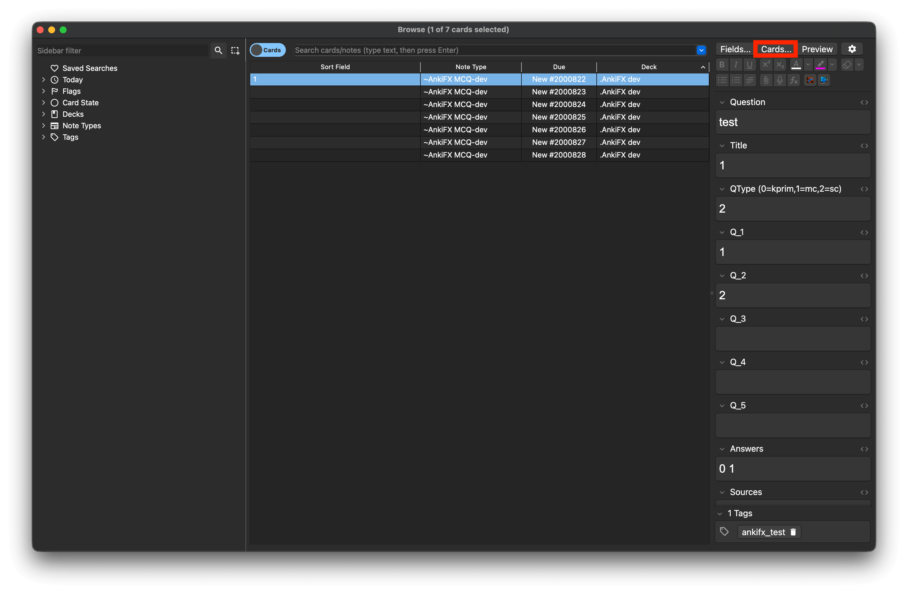
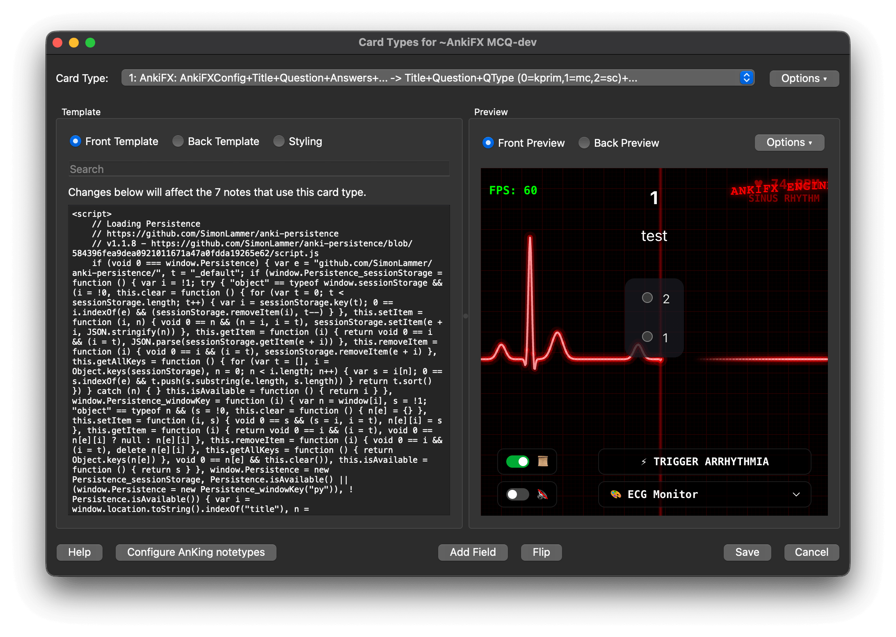
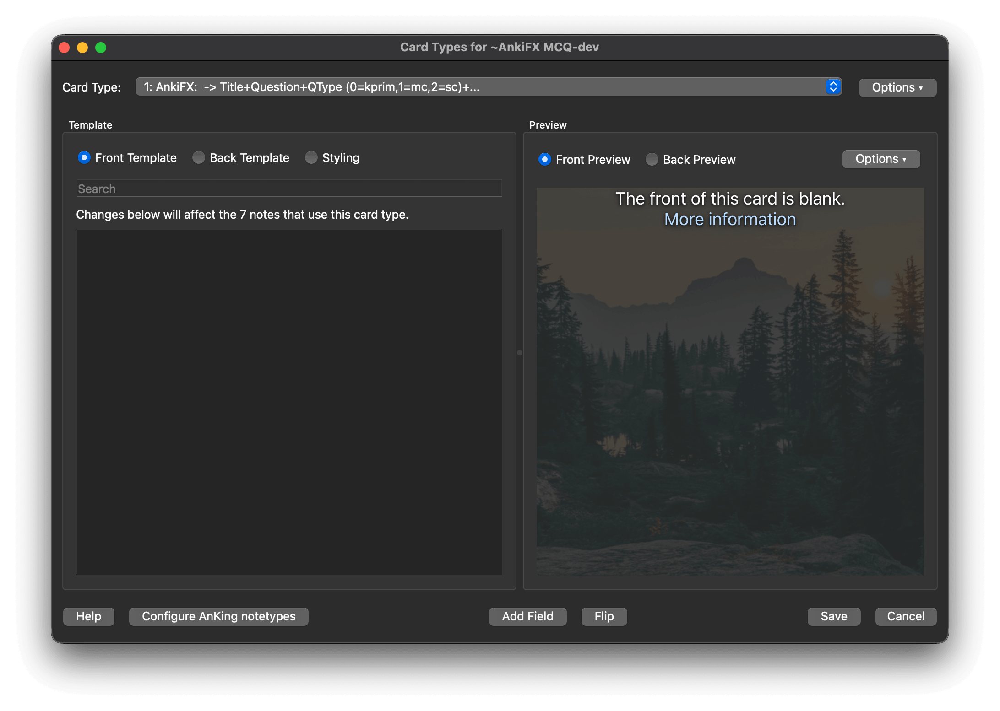
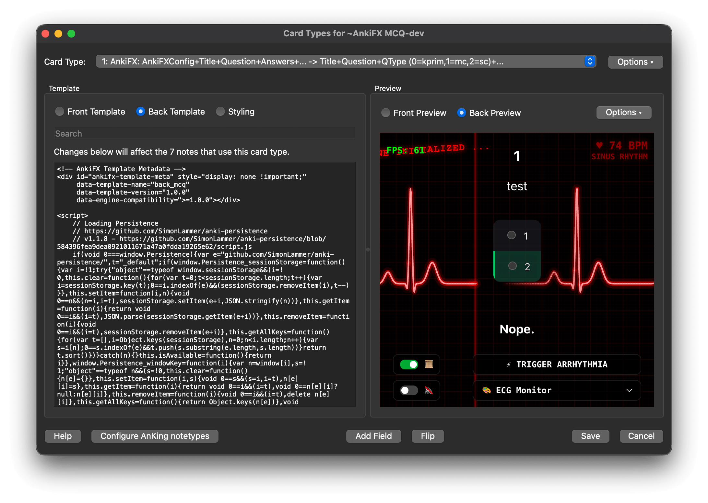
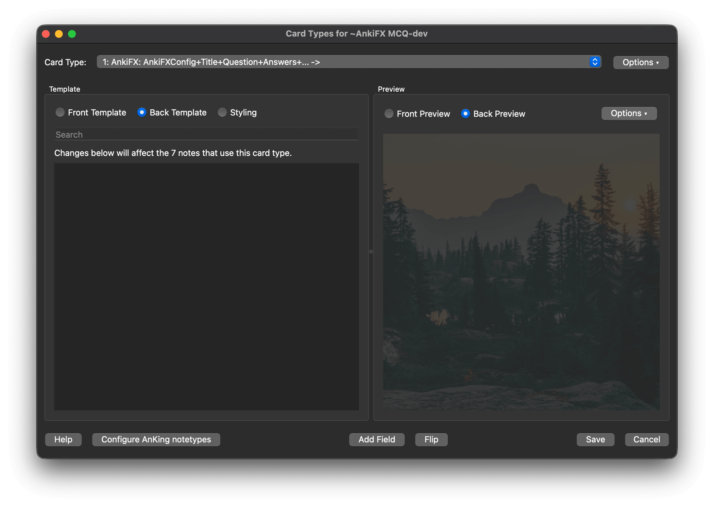
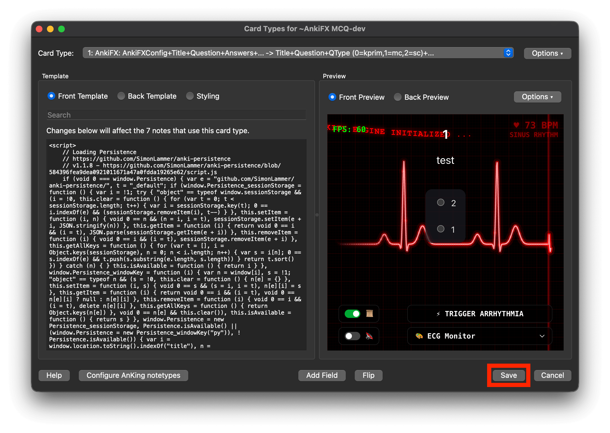

# AnkiFX Template Update Guide

This guide walks you through updating your Anki card templates to the latest version of AnkiFX. If you received a **"Legacy Template Detected"** or **"Template Update Available"** notice while reviewing cards, this guide is for you.

---

## Introduction

### Why did the notification appear?
AnkiFX periodically releases updates to card templates to add features, fix bugs, and ensure smooth compatibility with the latest versions of the visual effects engine. The notification appeared because Anki detected that your current cards are using an older or unversioned template system.

### Why do template updates matter?
Updating your templates ensures that all visual themes, timers, text overlays, and interactive features (like Multiple Choice choices) display correctly on all your devices, including computer screens, iPads, and mobile phones.

> [!IMPORTANT]
> **Your data is 100% safe.**
> Updating your template only changes **how** your cards are styled and displayed. 
> - You will **NOT** lose any cards.
> - Your **review history** and learning statistics are completely safe.
> - Your card **scheduling** (due dates, intervals) will not be reset.

---

## Step 1 — Download the Latest Template

Before modifying anything in Anki, you need to copy the latest template codes from the official AnkiFX repository.

Select and open the links below for your note type to view the latest template code:

* **MCQ Note Type**:
  - **Front Template**: [ankifx_mcq_front.html](https://github.com/robkipa/ankifx/blob/main/build/card%20templates/ankifx_mcq_front.html)
  - **Back Template**: [ankifx_mcq_back.html](https://github.com/robkipa/ankifx/blob/main/build/card%20templates/ankifx_mcq_back.html)
* **Basic Note Type**:
  - **Front Template**: [ankifx_basic_front.html](https://github.com/robkipa/ankifx/blob/main/build/card%20templates/ankifx_basic_front.html)
  - **Back Template**: [ankifx_basic_back.html](https://github.com/robkipa/ankifx/blob/main/build/card%20templates/ankifx_basic_back.html)
* **Shared Styling**:
  - **Card Styling (CSS)**: [card_styling.css](https://github.com/robkipa/ankifx/blob/main/build/card%20templates/card_styling.css)

Keep the page open so you can copy the contents in the next steps.

---

## Step 2 — Open Anki Card Templates

Next, navigate to the template editor on your desktop version of Anki:

1. Open **Anki** on your computer.
2. Select the deck containing your AnkiFX cards.
3. Click on **Browse** at the top of the main window.
4. Select any card/note from the list in the browser.
5. In the top-right menu, click **Cards...**.

---

## Step 3 — Update the Front Template

The Card Template Editor will open. You will see three tabs or boxes: **Front Template**, **Back Template**, and **Styling**.

1. Select the **Front Template** tab/box on the left.
2. Click inside the code box and select everything (press `Ctrl + A` on Windows/Linux, or `Cmd + A` on Mac).
3. Delete the selected text so the box is completely empty.

4. Go back to the files from **Step 1**, copy the entire contents of the new **Front Template** code, and paste it into the empty box.

> [!WARNING]
> Do not partially edit or change specific lines in the template. You must delete everything in the box first and replace the entire contents to prevent broken layouts.

---

## Step 4 — Update the Back Template

Now, repeat the same replacement process for the back of the card:

1. Select the **Back Template** tab/box on the left.
2. Click inside the code box and select everything (`Ctrl + A` / `Cmd + A`).
3. Delete the selected text so the box is completely empty.

4. Go back to the files from **Step 1**, copy the entire contents of the new **Back Template** code, and paste it into the empty box.

---

## Step 5 — Update the Styling (CSS)

Next, update the shared CSS styling that controls the visual appearance of both cards:

1. Select the **Styling** toggle in the middle of the template editor.
2. Click inside the code box and select everything (`Ctrl + A` / `Cmd + A`).
3. Delete the selected text so the box is completely empty.
4. Go back to the files from **Step 1**, copy the entire contents of the new **Card Styling (CSS)** code, and paste it into the empty box.

---

## Step 6 — Save Changes

1. Click the **Save** button in the bottom-right corner of the Card Template Editor.

2. Go back to your deck list and click on the deck to review a few cards.

---

## Step 7 — Verify Successful Update

To ensure the update was completed successfully, review a card and verify the following:

- The card contents, questions, and options render normally.
- Your customized AnkiFX visual background and effects load correctly.
- The **"Legacy Template Detected"** banner has disappeared.

> [!NOTE]
> In the future, if a template update notice banner appears indicating a newer release is available, it is simply a notice. You can choose to dismiss it by clicking the close button. Once dismissed, the dismissed state is stored persistently in your device's `localStorage` so that the banner does not re-appear and interrupt your study sessions.

---

## Troubleshooting

| What is happening | Why it happened | How to fix it |
| :--- | :--- | :--- |
| **Cards appear blank** | The template code was not fully copied or was pasted into the wrong box. | Re-open the template editor, delete all contents in the Front and Back boxes, and paste the clean codes from Step 1 again. |
| **Styling looks broken** | Leftover code from the previous template was not fully deleted before pasting. | Ensure you delete the entire text field of the Front and Back templates before pasting the new codes. |
| **I accidentally deleted template content** | Typing or deleting code by mistake. | Close the template editor without clicking "Save" (or click "Cancel"), then re-open it to revert to your last saved state. |
| **The update notice still appears** | Anki is loading a cached version of the card or the template name/version metadata was modified. | Restart Anki. If it persists, ensure you copied the absolute latest templates from GitHub. |
| **AnkiFX effects do not load** | The local script file (`_ankifx.js`) is missing from your media folder or you are offline. | Ensure the local script backup is present in your `collection.media` folder, or connect to the internet to load CDN engine assets. |

---

## FAQ

### Will I lose my cards?
No. Your cards are stored in your Anki database separately from the templates. Modifying the template only updates the visual wrapper used to display them.

### Will I lose review history?
No. Your scheduling logs, retention rates, and review logs are linked to your cards and will remain completely unaffected.

### Do I need to update every deck?
No. If multiple decks use the same Note Type, updating the card template once will automatically update all cards in all decks using that note type.

### How often should I update?
You only need to update when you see a notice indicating a new version is available or if you encounter a bug.

### What if I customized the template?
If you manually added custom HTML, CSS, or fields to your templates, you will need to manually port those changes into the new template code. Copy your custom modifications, update the template, and paste them back into their respective sections.
